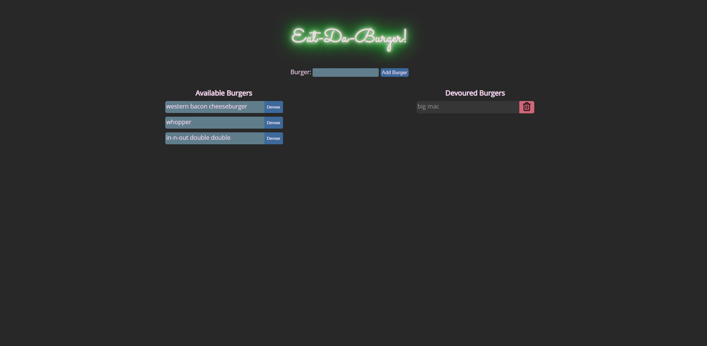

# eat-da-burger

This is a burger logger that uses MySQL, Node, Express and Handlebars. It uses the Model-View-Controller pattern to separate the different logic into different files.

## Built With

- Node.js
- Express
- MySQL (uses jawsDB if available)
  - Created custom ORM for basic queries
- Handlebars Templating Engine
- MVC Design Pattern

## Usage

Eat-Da-Burger! is an app that lets users input the names of burgers they'd like to eat.
Whenever a user submits a burger's name, the app will display the burger on the left side of the page -- waiting to be devoured. When the `Devour` button is pressed the burger moves to the right side where it shows eaten burgers. Burgers can also be deleted from the database clicking the red trash button.

## Running It

Open terminal in root directory of this project

1. Get the packages from packages.json

   - `npm install`

2. Run server
   - `node server.js`

## Link

https://morning-escarpment-68992.herokuapp.com/

